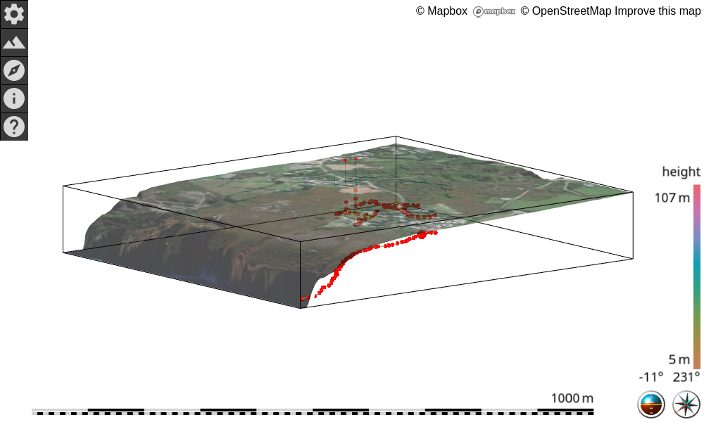

# Wheal Pell

This repository contains the survey data and files for the Wheal Pell mine surveying project.

## Contents

- [About](#about)
- [Survey](#survey)
- [Contributing](#contributing)
- [Credits](#credits)
- [License](#license)

## Survey

The survey has not been completed, but you can find the most recent `.3d` file in [the latest release](https://github.com/aricooperdavis/wheal-pell/releases/latest), or [view a 3D render online](https://aricooperdavis.github.io/wheal-pell/).

## About

Wheal Pell is a mine in the St Agnes Consols set, in Cornwall. The workings are extensive and interesting, with a number of large open stopes, internal winzes, and shafts to the surface.

You can [see some 3D scans of areas of the mine on my blog](https://cooper-davis.net/blog/3d-scanning-abandoned-mines).

> :warning: Wheal Pell is on private land and __must not__ be accessed without the owners permission.

Producing a complete survey is a substantial undertaking, so this repo is used to document progress as it is made. Surveying is performed "paperless" using [SexyTopo](https://github.com/richsmith/sexytopo) to record data, and a [Shetland Attack Pony v5](https://www.shetlandattackpony.co.uk/) digital surveying tool to take measurements.

## Contributing

To extend the survey:

- Start your survey from an existing station on the survey, and create an `.svx` file with your new survey data (using something like SexyTopo).
- Add the new `.svx` file to the `./Survex` directory. Name this file using the format `pell-{yyyy}-{mm}-{dd}.svx`, and `*export` the station you have started the new survey at.
- In `pell.svx`, `*include` the new file, and `*equate` the exported survey station to the appropriate existing station in the survey.
  - You may need to `*export` that station from the appropriate survey part if it has not alread been `*export`ed.

Please make sure you save your SexyTopo data folder in the `./SexyTopo` directory, so that we can use your annotations to draw up the survey.

## Credits

- Matt Palmer - _Notetaking_
- Ari Cooper-Davis - _Instruments_

## License

This project is licensed under the [MIT License](LICENSE).
